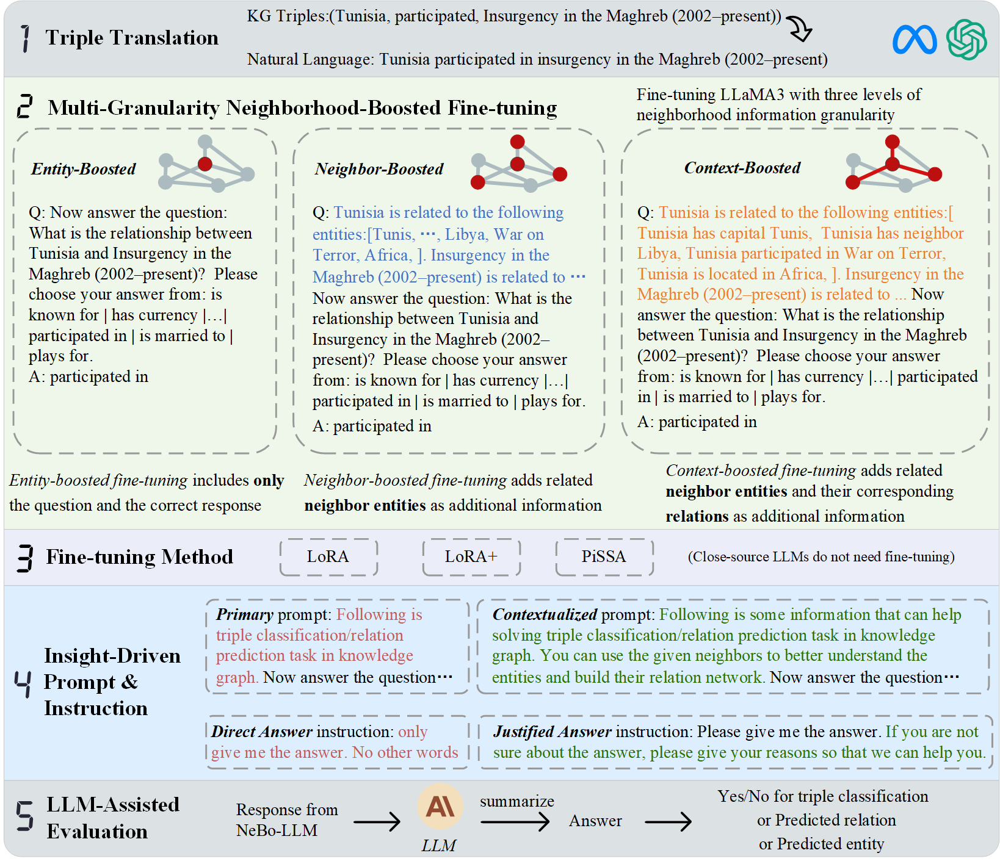

# NB-LLM: Neighborhood-Boosted Large Language Model for Knowledge Graph Completion

This repo introduces the implementation of NeBo-LLM in our paper.

## Abstract
Large Language Models (LLMs) have demonstrated remarkable prowess in handling Knowledge Graph Completion (KGC) tasks. 
While existing LLM-based methods consider triples in knowledge graphs (KGs) as text sequences to analyze the semantic information, they often overlook the graph's structural dependencies. 
In this paper, we propose a novel LLM-based method for KGC, termed **Ne**ighborhood-**Bo**osted **L**arge **L**anguage **M**odel (NeBo-LLM). Our approach transforms KG triples into descriptive texts and leverages these descriptions to enhance the LLM's understanding of both semantic and structural patterns from KG. 
Specifically, NeBo-LLM samples the neighbors and relations of each entity within the knowledge graph to assemble multi-granularity local neighborhood information. This process enriches the entity nodes with structural details, enabling LLMs to comprehend relations more effectively and improve reasoning capabilities through fine-tuning. 
Additionally, we explicitly define the details of the tasks and problem statements through customized prompts and instructions, which guide LLMs in the reasoning processes and responses to KGC queries.
Finally, we employ LLMs to concisely summarize the responses from NeBo-LLM to derive final answers. 
Notably, our model is fine-tuned based on a significantly smaller data scale than previous works, benefiting from integrating comprehensive neighborhood information and precise prompts and instructions. 
Experiments on several knowledge graph benchmarks reveal that NeBo-LLM achieves new SOTA in KGC tasks and even surpasses LLMs fine-tuned with up to 10 times the data scale of our experiments.

<div align="center">

</div>


## Getting Start

### Installing requirement packages

```shell
pip install -r requirements.txt
```


*more details coming soon*
